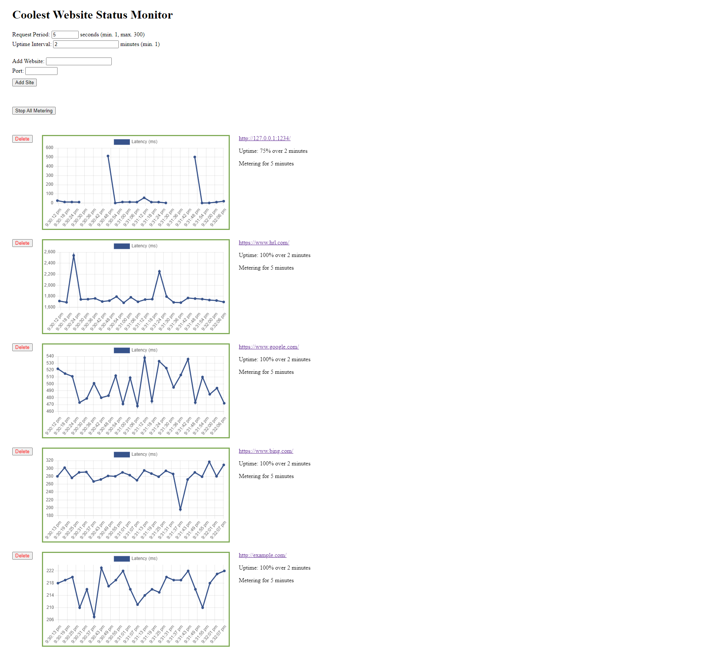

# Installation
To install dependencies run `pip install -r requirements.txt` in your environment.

# Running the app
- To run the main app: `python website-status-monitor/app.py` and go to http://127.0.0.1:5000
- To run test server: `python test_server.py 1234 0.75 60`. You can customize port, uptime percentage, and cycle length (in seconds), respectively. Cycle length means how often the server should be restarted, e.g. if cycle length is 60 and uptime percentage is .75, then the server is running for 45 second and being stopped for 15 seconds, in an infinite loop.
- To run unit tests:  `cd website-status-monitor` and then `python -m unittest tests.py`

# Notes
- I only implemented simple input validation, so URLs must be entered in their full form (with protocol, eg. https://google.com). If the specified port is used by default by the protocol, it won't be included in the URL (eg. 443 for https, 80 for http, etc.).
- When the app is opened in more than one browser tab, unexpected behaviour might occur due to the app using local storage for persisting data, which is shared between tabs.
- It would be more optimal to check website status on the client side, but to get around the CORS policy, I had to implement a simple endpoint that does it on the backend.

# Screenshot
Screenshot of the app running for 5 minutes, with 5 websites, a sampling period of 5 seconds and an interval of 2 minutes.

